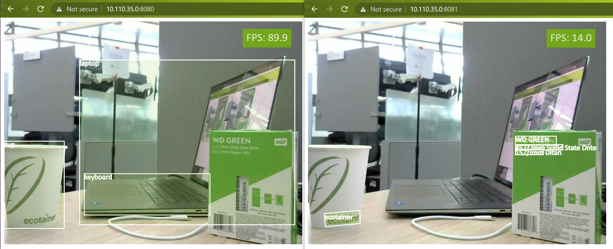

This page details setup steps for running multiple JetNet containers with a webcam as a shared input

## Webcam loopback setup

### V4L2 loopback device creation

To share a webcam across multiple containers, set up a v4l2loopback device.  First, install some dependencies

```bash
sudo apt-get update
sudo apt-get install v4l2loopback-dkms v4l-utils ffmpeg
```

Check which camera devices are currently on the system.

```bash
ls /dev/video*
v4l2-ctl --list-devices
```

Create a v4l2loopback device with an unused device ID.  We'll assume device ID `10` is unused.

```bash
sudo modprobe v4l2loopback video_nr=10 exclusive_caps=1 card_label="Virtual webcam"
```

You should find `/dev/video10` got created.  You can verify this again by calling ``v4l2-ctl --list-devices``.

### Start streaming to the v4l2loopback device

#### Terminal 0

In one terminal, use ffmpeg to stream the real camera device, which we'll assume is ``/dev/video0`` to the virtual camera we created ``/dev/video10``

```bash
ffmpeg -f v4l2 -i /dev/video0 -f v4l2 /dev/video10
```

This will keep running, so leave this terminal open.


## Run JetNet containers

Example of running two containers;

- one for demo-ing `jetnet demo jetnet.yolox.YOLOX_NANO_TRT_FP16` and,
- the other for demo-ing `jetnet.easyocr.EASYOCR_EN_TRT_FP16`

#### Terminal 1

Open a new terminal, and launch the first container for object detection.

```bash
cd jetnet
sudo docker run \
    --network host \
    --gpus all \
    --runtime nvidia \
    -it \
    --rm \
    --name=jetnet1 \
    -v $(pwd):/jetnet \
    --device /dev/video10 \
    -v /tmp/.X11-unix:/tmp/.X11-unix \
    -e DISPLAY=$DISPLAY \
    jaybdub/jetnet:l4t-35.1.0 \
    /bin/bash -c "cd /jetnet && python3 setup.py develop && jetnet demo --port 8080 --camera_device 10 jetnet.yolox.YOLOX_NANO_TRT_FP16"
```

Open a web browser and access `http://<IP_ADDRESS>:8080`.

> If you are using the same Jetson to run the web browser, it is `http://0.0.0.0:8080`

#### Terminal 2

Open another terminal, and launch the second container for text detection.  Notice that we use a different port.

```bash 
cd jetnet
sudo docker run \
    --network host \
    --gpus all \
    --runtime nvidia \
    -it \
    --rm \
    --name=jetnet2 \
    -v $(pwd):/jetnet \
    --device /dev/video10 \
    -v /tmp/.X11-unix:/tmp/.X11-unix \
    -e DISPLAY=$DISPLAY \
    jaybdub/jetnet:l4t-35.1.0 \
    /bin/bash -c "cd /jetnet && python3 setup.py develop && jetnet demo --port 8081 --camera_device 10 jetnet.easyocr.EASYOCR_EN_TRT_FP16"
```

Open a web browser and access `http://<IP_ADDRESS>:8081`.

> If you are using the same Jetson to run the web browser, it is `http://0.0.0.0:8081`

## Result


